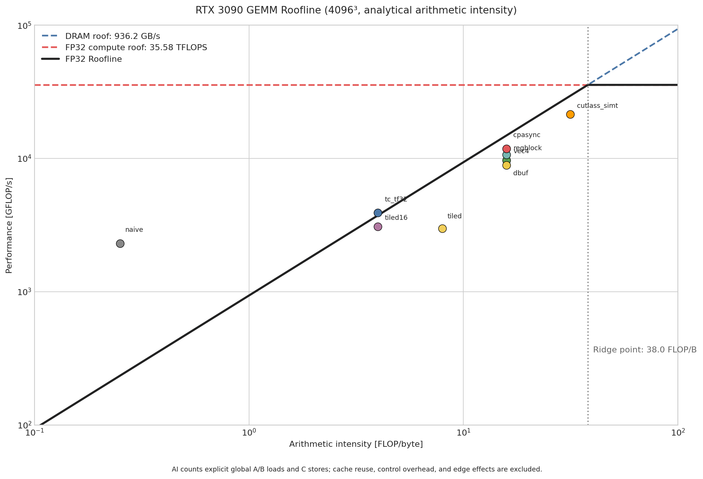

# GEMM Kernel 实现与性能分析

## 1. 环境与测试方法

- GPU：NVIDIA GeForce RTX 3090（SM 86）
- CUDA：11.7
- 编译：Release，`-O3 -lineinfo`，`CMAKE_CUDA_ARCHITECTURES=86`
- 数据类型：A、B、C 均为 row-major `float32`
- 计算定义：`C[M, N] = A[M, K] × B[K, N]`
- 性能统计：CUDA Event；3 次 warmup，5 次测量，按最短耗时计算 GFLOPS
- 大矩阵命令：

```bash
./build/gemm_bench --skip-check -M 4096 -N 4096 -K 4096 --iters 5
```

`--skip-check` 会跳过 CPU double 参考实现和 D2H 回传，只测 GPU kernel。4096³ 的 CPU reference 约需 687 亿次标量乘加，不适合作为常规性能测试流程。所有 kernel 已额外通过 `M=257, N=255, K=259` 的非整除尺寸正确性验证；`tc_tf32` 使用 `--rel-tol 2e-2 --abs-tol 5e-2`，其余 FP32 kernel 使用默认 `rel_tol=1e-2, abs_tol=1e-4`。

4096³ 总计算量为：

```text
2 × 4096³ = 137.439 GFLOP
```

## 2. 性能总览

| 排名 | kernel | best (ms) | avg (ms) | GFLOPS | 相对 naive |
|---:|---|---:|---:|---:|---:|
| 1 | cutlass_simt | 6.4193 | 6.4863 | 21410.3 | 9.29× |
| 2 | cpasync | 11.6272 | 11.6296 | 11820.5 | 5.13× |
| 3 | vec4 | 12.8926 | 12.9677 | 10660.3 | 4.63× |
| 4 | regblock | 14.1822 | 14.2840 | 9690.9 | 4.20× |
| 5 | dbuf | 15.4558 | 15.7666 | 8892.4 | 3.86× |
| 6 | tc_tf32 | 35.2571 | 35.3045 | 3898.2 | 1.69× |
| 7 | tiled16 | 44.5996 | 44.6238 | 3081.6 | 1.34× |
| 8 | tiled | 46.0051 | 46.0084 | 2987.5 | 1.30× |
| 9 | naive | 59.6357 | 59.6491 | 2304.6 | 1.00× |

`best` 与 `avg` 接近，说明当前测试下 kernel 执行稳定。CUTLASS SIMT 实现达到 21.41 TFLOPS，是当前最佳结果，约为 naive 的 9.29×，并高于自研 `cpasync` 的 11.82 TFLOPS。

## 3. Roofline 与算术强度



### 3.1 计算模型

图由 `scripts/plot_roofline.py` 生成，使用 4096³ 的实测性能和解析算术强度。由于当前环境禁止 NCU 读取 GPU performance counter，这不是基于实测 DRAM transactions 的 empirical Roofline，而是根据每种算法显式 global-memory 访问量得到的 **algorithmic Roofline**。

对于一个 block tile 为 `BM×BN` 的 shared-memory GEMM，假设每个 A/B 元素在该输出 tile 内只从 DRAM 读取一次、每个 C 元素只写回一次：

```text
FLOPs       = 2MNK
DRAM bytes  = 4 × (MNK / BN + MNK / BM + MN)
AI          = FLOPs / DRAM bytes
```

`naive` 不使用 block 内复用，模型为：

```text
DRAM bytes = 4 × (2MNK + MN)
AI         = 2MNK / [4 × (2MNK + MN)]
```

硬件 roof 采用 RTX 3090 的 936.2 GB/s DRAM 峰值带宽及 35.58 TFLOPS FP32 峰值计算吞吐。ridge point 为：

```text
35,580 / 936.2 = 38.0 FLOP/B
```

低于 38 FLOP/B 的内核在该理论模型中属于 memory-bound 区域；高于此点才可能触及 FP32 compute roof。

### 3.2 算术强度表

| kernel | block tile 模型 | AI（FLOP/B） | Roofline 上限（TFLOPS） | 实测（TFLOPS） | 上限利用率 |
|---|---|---:|---:|---:|---:|
| naive | 无复用 | 0.250 | 0.234（悲观下界） | 2.305 | 不适用 |
| tiled16 | 16×16 | 3.992 | 3.737 | 3.082 | 82.5% |
| tc_tf32 | 16×16 | 3.992 | 3.737（FP32 roof） | 3.898 | 不适用 |
| tiled | 32×32 | 7.969 | 7.460 | 2.988 | 40.1% |
| regblock | 64×64 | 15.876 | 14.862 | 9.691 | 65.2% |
| vec4 | 64×64 | 15.876 | 14.862 | 10.660 | 71.7% |
| dbuf | 64×64 | 15.876 | 14.862 | 8.892 | 59.8% |
| cpasync | 64×64 | 15.876 | 14.862 | 11.821 | 79.5% |
| cutlass_simt | 128×128 | 31.508 | 29.499 | 21.410 | 72.6% |

`naive` 与 `tc_tf32` 显示超过解析 DRAM roof，原因不同：

- `naive` 的公式假定每次点积 load 都到达 DRAM，但实际 L1/L2 cache 会提供部分复用，因此该 AI 是悲观下界。
- `tc_tf32` 的点使用了 FP32 roof，而其计算单元是 Tensor Core；TF32 Tensor Core 的专用计算峰值远高于 FP32 CUDA Core roof，因此不能用 FP32 compute roof 衡量它的 compute-side 上限。

这两个例子说明：解析 AI 适合比较同一 FP32 数据路径的访问复用趋势，不能替代 NCU counter 驱动的实际 DRAM Roofline。

### 3.3 图表解读

1. 所有 FP32 tiled 路线的 AI 都小于 38 FLOP/B，因此在理想 DRAM 模型中仍位于 memory-bound 区域；要跨过 ridge point，需要提高输出 tile 的 A/B 复用，或减少有效 DRAM 访问。
2. `tiled16` 已接近其解析 bandwidth roof，说明小 tile 版本受内存访问限制较明显；进一步提高它的计算指令效率收益有限。
3. `tiled` 的实际性能只有解析 roof 的 40.1%。1024-thread block、低 thread-level reuse 和频繁 block barrier 是主要额外开销。
4. `regblock` 将 AI 从 7.97 提升至 15.88 FLOP/B，且把性能提高至 9.69 TFLOPS。寄存器分块同时提高了复用和 ILP。
5. `vec4` 与 `regblock` 的算法 AI 相同，但性能提升到 10.66 TFLOPS；这是向量化减少 load 指令和地址计算开销的收益，AI 本身不会体现这种差异。
6. `dbuf` 的 AI 同样不变但性能下降，验证了普通 shared-memory ping-pong 并不能自动制造搬运-计算重叠。
7. `cpasync` 达到对应解析 roof 的 79.5%，是当前最佳自研 FP32 实现。剩余差距包括同步、指令发射、shared-memory 访问、pipeline 深度不足以及实际内存访问开销。
8. `cutlass_simt` 使用 128×128×8 threadblock tile，将 AI 提升至 31.51 FLOP/B，距离 ridge point 仅一步之遥；实测 21.41 TFLOPS，是对应解析 roof 的 72.6%。其优势来自成熟的 threadblock/warp 分块、迭代器与 epilogue 实现。
9. `tc_tf32` 的点不应与 FP32 Roofline 直接比较；后续应使用 TF32 Tensor Core 峰值建立独立 roof，并实现更大的多-warp tile 后再评估其计算利用率。

重新生成图：

```bash
python3 scripts/plot_roofline.py
```

## 4. 逐实现分析

### 4.1 `naive`

文件：`kernels/gemm_naive.cu`

设计：`16×16` 线程块，每线程计算 C 的一个元素。线程直接从 global memory 中读取对应的 A 行和 B 列，并执行长度为 K 的点积。

```text
每线程：1 个 accumulator
每 block：16×16 个 C 元素
共享内存：0 B
```

优点：实现最简单；索引和边界处理直接；适合用作正确性基线。

限制：同一个 A/B 元素被大量线程从 global memory 重复读取；没有 block 内复用。每线程只有一条独立累加链，指令级并行度有限。

结果：2304.6 GFLOPS。它是所有后续优化的性能基线。

### 4.2 `tiled`

文件：`kernels/gemm_tiled.cu`

设计：`32×32` 线程块负责一个 `32×32` C tile。每轮加载 A 的 `32×32` tile 和 B 的 `32×32` tile 到 shared memory，每线程对当前 K tile 执行 32 次 FMA。

```text
每线程：1 个 accumulator
每 block：1024 线程，计算 32×32 C tile
共享内存：sA[32][32] + sB[32][32] = 8 KB
同步：每个 K tile 两次 __syncthreads()
```

收益：A tile 的每个元素被同一行 32 个线程复用；B tile 的每个元素被同一列 32 个线程复用。global memory 的重复读取显著降低。

限制：1024 threads/block 是较大的调度粒度；每线程仍只计算一个输出元素，寄存器复用不足；每个 K tile 需要两次 block 同步。

结果：2987.5 GFLOPS，较 naive 提升 29.6%。shared memory tiling 有效，但此版本尚未解决每线程计算量低的问题。

### 4.3 `tiled16`

文件：`kernels/gemm_tiled16.cu`

设计：与 `tiled` 算法相同，但 tile 与 block 改为 `16×16`。

```text
每线程：1 个 accumulator
每 block：256 线程，计算 16×16 C tile
共享内存：2 KB
```

目标：降低每个 block 的线程和资源规模，获得更细粒度的 SM 调度与更高的并发 block 数。

结果：3081.6 GFLOPS，略优于 `tiled`。这说明当前场景下 1024-thread block 的调度限制大于 32 tile 带来的复用收益。

限制：tile 缩小也降低了 A/B 数据复用和每次同步后的计算量，因此收益有限。它是适合与 `tiled` 对照的 occupancy 基线，而非最终高性能设计。

### 4.4 `regblock`

文件：`kernels/gemm_regblock.cu`

设计：`16×16=256` 线程的 block 计算一个 `64×64` 输出 tile。每线程维护 `4×4=16` 个 FP32 accumulator；A 和 B 的片段从 shared memory 读到寄存器后被多个 FMA 重复使用。

```text
block tile：BM=64, BN=64, BK=8
thread tile：TM=4, TN=4
每线程：16 个 C accumulator
共享内存：A[64][8] + B[8][64] = 4 KB
```

收益：相比单输出线程，每次 shared memory 读取可以驱动更多 FMA；16 个 accumulator 提升了 ILP；256-thread block 有更好的调度弹性。

结果：9690.9 GFLOPS，较 naive 4.20×，较 tiled 3.24×。这是性能跃迁最大的基础优化步骤。

限制：寄存器压力明显增加。进一步增大 thread tile 可能带来寄存器 spill 或降低 occupancy，因此需要根据编译资源与硬件计数器继续调参。

### 4.5 `vec4`

文件：`kernels/gemm_vec4.cu`

设计：计算核心沿用 `regblock` 的 `64×64×8` block tile 和 `4×4` thread tile。global-to-shared 数据搬运对完整且对齐的 tile 使用 `float4`，一次搬运 16 B；M/N/K 的尾块自动退回逐 float 的 predicated load，并将无效位置填零。

```text
完整 tile：float4 global load/store 到 shared memory
边界 tile：标量 load + 越界补零
计算：与 regblock 相同
```

收益：减少 global-memory load 指令数；连续 K/N 维访问保持合并访问；在 4096³ 这类各维度均为 4 倍数的场景中，全部 block 走向量化快路径。

结果：10660.3 GFLOPS，较 regblock 提升 10.0%，较 naive 4.63×。

限制：向量化的优势依赖 leading dimension 与访问地址 16 B 对齐。非整除维度或边缘 block 会转入标量路径，性能下降是预期行为；实现中必须始终保留边界回退，不能对尾部直接解引用 `float4*`。

### 4.6 `dbuf`

文件：`kernels/gemm_dbuf.cu`

设计：以 `regblock` 为计算基础，使用 `sA[2]`、`sB[2]` 构成 ping-pong shared-memory tile。当前 stage 被计算时，下一个 stage 被写入另一组 shared memory；阶段切换后复用原 stage。

```text
共享内存：2 × (A[64][8] + B[8][64]) = 8 KB
stage：0 / 1 ping-pong
计算：4×4 register blocking
```

收益：明确了多 stage tile 的生命周期，为异步流水实现提供了正确的存储结构。

结果：8892.4 GFLOPS，低于 `regblock`。原因是普通 global load 不会自动与计算重叠，双缓冲增加了 shared memory、同步和地址计算开销，却没有真正隐藏 global-memory latency。

结论：仅使用 shared-memory ping-pong 不是充分的性能优化；它主要是 `cp.async` 的结构准备。真正的搬运-计算重叠需要硬件异步复制。

### 4.7 `cpasync`

文件：`kernels/gemm_cpasync.cu`

设计：在 `dbuf` 的两级 shared-memory stage 基础上，对完整、对齐的 tile 使用 Ampere `__pipeline_memcpy_async`。在计算当前 stage 时，发起下一 K tile 的 global-to-shared 异步拷贝；通过 `__pipeline_commit` 与 `__pipeline_wait_prior` 保证消费者只读取已完成的 stage。边界 tile 使用安全的标量回退路径。

```text
硬件要求：SM 80+
目标 GPU：RTX 3090，SM 86
shared stages：2
快路径：16 B cp.async（float4）
边界路径：标量 predicated load + 补零
计算：4×4 register blocking
```

收益：global-to-shared 搬运由异步 copy engine 发起，可与当前 stage 的 FMA 计算重叠；register blocking 提供足够计算工作，帮助隐藏访存延迟。

结果：11820.5 GFLOPS，是当前最优实现，较 vec4 提升 10.9%，较 naive 5.13×。

限制：当前是 2-stage 基础 pipeline。可尝试 3/4 stage、增加 BK、改进线程级搬运映射以及结合更大的 register tile。尾部 scalar fallback 导致非整除问题规模下性能低于完整 tile 是正常现象。

### 4.8 `tc_tf32`

文件：`kernels/gemm_tc_tf32.cu`

设计：使用 Ampere Tensor Core 的 WMMA TF32 指令。每个 block 仅使用一个 warp 计算一个 `16×16×8` MMA tile；A/B 先载入 shared memory，使用 `wmma::load_matrix_sync`、`wmma::mma_sync` 与 `wmma::store_matrix_sync` 完成矩阵乘加。

```text
每 block：1 warp
MMA tile：16×16×8 TF32
输入：float32 storage，Tensor Core 以 TF32 乘法精度执行
累加与输出：float32
```

数值特性：TF32 的输入有效尾数低于 FP32，因此相对 double reference 存在可见误差。本项目中 `tc_tf32` 应使用：

```bash
--rel-tol 2e-2 --abs-tol 5e-2
```

结果：3898.2 GFLOPS，虽然优于 naive，但远低于高质量 Tensor Core GEMM 应有水平。

原因：当前实现每 block 只有一个 warp、每 warp 每轮只计算一个 16×16×8 MMA tile，block tile 太小，global/shared 搬运与同步开销占比高，SM 内 Tensor Core 的供给不足。该实现的价值是验证 TF32 WMMA 路径、布局、尾块填零和精度契约，不是最终性能实现。

优化方向：一个 block 分配多 warp，计算更大的 `64×64` 或 `128×128` C tile；多 stage shared pipeline；按 warp 分配多个 MMA fragment；使用 `cp.async` 预取 A/B；避免每轮只处理一个极小 K tile。

### 4.9 `cutlass_simt`

文件：`kernels/gemm_cutlass_simt.cu`

依赖：`third_party/cutlass/`，固定版本 CUTLASS v2.10.0（commit `fc9ebc6`）。CMake 通过 `cutlass_headers` INTERFACE target 仅导入 CUTLASS 的 header，无需构建 CUTLASS 全部工具或测试。

设计：使用 CUTLASS 的 `cutlass::gemm::device::Gemm` 通用 FP32 SIMT 实现：A/B/C 为 row-major float，FP32 累加，`OpClassSimt`，`Sm80`，threadblock tile 为 `128×128×8`，warp tile 为 `32×64×8`，两级 shared-memory pipeline。使用 alignment=1，因此可支持任意 M/N/K 和任意合法 row-major leading dimension。

```text
threadblock tile：128×128×8
warp tile：32×64×8
计算类别：SIMT FP32，不使用 Tensor Core
对齐：A/B alignment=1
```

结果：4096³ 下 **6.4193 ms / 21410.3 GFLOPS**，是 naive 的 9.29×、自研 cpasync 的 1.81×；在 `1000×999×1001` 非整除问题上通过默认 FP32 校验，达到 15273.7 GFLOPS。

分析：这证明成熟 GEMM 库的优势不只来自 Tensor Core，也来自层级化 block/warp/thread tile、访问迭代器、寄存器调度、epilogue 与边界处理的整体协同。该版本未使用 Tensor Core，数值仍是 FP32 路径；它应作为当前自研 FP32 kernel 的高质量性能基线。

限制：此版本为 CUTLASS 通用 SIMT 配置，不是其最优配置。直接采用 TF32 Tensor Core 配置时，K/N 非 4 对齐的输入会触发底层 iterator 的对齐限制；若要提供通用 Tensor Core 路径，需要为 A/B/C 分配和填充对齐后的 workspace，或根据尺寸 dispatch 到 Tensor Core 快路径与 SIMT 尾部路径。

## 5. 优化路径总结

```text
naive
  └─ shared memory tiling：tiled / tiled16
      └─ register blocking：regblock
          └─ vectorized load：vec4
              └─ shared ping-pong：dbuf
                  └─ asynchronous copy pipeline：cpasync

独立精度路线：tc_tf32
```

观察到的关键结论：

1. shared memory 解决 global-memory 重复读取，但每线程单输出时收益有限。
2. register blocking 是 FP32 路线的核心步骤：提高 shared-memory 数据复用、增加 ILP，并降低 block 调度压力。
3. `float4` 向量化在连续且对齐的大矩阵中有效，但必须保留任意维度的安全回退。
4. 普通双缓冲不会自动隐藏延迟；异步拷贝才使计算与搬运实际重叠。
5. Tensor Core 不是只替换一条 MMA 指令即可获得高性能。warp tile、block tile、数据供给和 pipeline 必须共同设计。

## 6. 后续建议

### 6.1 优先优化 `cpasync`

1. 将 2-stage 改为 3-stage/4-stage，测量不同 K 规模下的隐藏延迟效果。
2. 增加 `BK`，例如 16 或 32；同时检查 shared memory、寄存器压力和 occupancy 的平衡。
3. 尝试 `TM×TN` 的不同组合，例如 `4×8` 或 `8×4`，避免寄存器 spill。
4. 使用 Nsight Compute 的 `SpeedOfLight`、`Occupancy`、`Warp Stall`、`Memory Workload` 章节验证瓶颈。当前环境若未开放 GPU counter，可先用 Nsight Systems 与 CUDA Event 做趋势对比。

### 6.2 重构 Tensor Core 路径

1. 将一个 block 扩展为 4/8 个 warp，每个 warp 负责一个或多个 `16×16` MMA tile。
2. 使用 `64×64×K` 或 `128×128×K` block tile，提高 shared-memory 和 global-memory 搬运的复用。
3. 引入 `cp.async` 数据搬运 pipeline，并将 MMA 计算与下一 stage 的搬运重叠。
4. 若目标是最高性能，使用 CUTLASS 作为设计参考或基线；若目标是学习，则逐步实现 warp-level MMA 与多 stage pipeline。
5. 将 TF32 与 FP32 kernel 分开对比，并在报告中明确误差阈值与精度语义。

## 7. 常用命令

完整正确性与中等规模性能：

```bash
./build/gemm_bench -M 1024 -N 1024 -K 1024 --iters 10
```

只验证指定 FP32 kernel 的非整除边界：

```bash
./build/gemm_bench --kernels cpasync -M 257 -N 255 -K 259 --iters 3
```

验证 TF32：

```bash
./build/gemm_bench --kernels tc_tf32 -M 1024 -N 1024 -K 1024 \
  --rel-tol 2e-2 --abs-tol 5e-2
```

大矩阵 GPU-only 性能比较：

```bash
./build/gemm_bench --skip-check -M 4096 -N 4096 -K 4096 --iters 5
```

检查内存越界与同步问题：

```bash
compute-sanitizer ./build/gemm_bench --kernels cpasync -M 257 -N 255 -K 259
```
